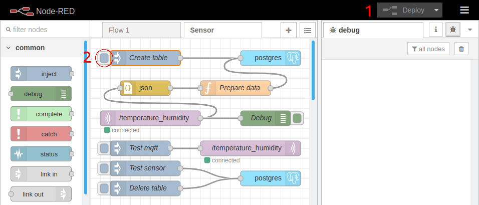

# sensor2graph-micropython-esp32

This project shows how to get data from a sensor, save it into a database, and visualize it.


To do that it uses different components. 
A [DHT11](https://learn.adafruit.com/dht) is used as sensor, which can output temperature and humidity.
An [ESP32](https://www.espressif.com/en/products/hardware/esp32/overview) reads this data and sends it over WIFI to a MQTT server.
The MQTT server ([Eclipse Mosquitto](https://mosquitto.org/)) serves as an intermediary to receive sensor data and redistribute further.
[Node-RED](https://nodered.org/) gets the data from the MQTT server and saves it into the database.
[PostgreSQL](https://postgresql.org/) is the database that saves the data and allows it to be displayed later.
The visualization is done with [Grafana](https://grafana.com/).
[Docker Compose](https://docs.docker.com/compose/install/) is used to make it easier to start the server components (Eclipse Mosquitto, Node-RED, PostgreSQL, and Grafana).

## Requirements

- ESP32
- DHT11 sensor
- 4.7k or 10k Ohm resistor for DHT11 with 4 pins, not needed for DHT11 with 3 pins
- Wires
- WIFI
- Docker Compose

## Setup

### ESP32

#### Wiring

The DHT11 sensor used in this project comes in two formats: simple or as component.

- Simple

It has 4 pins, doesn't include a resistor, and the 3rd pin from the left is not used. Connect the 3.3 volt (red cable) to the left pin, data (default pin 23, blue cabel) to the second pin from the left, and ground (black cabel) to the pin on the right. Connect a 4.7k or 10k Ohm resistor between 3.3 volt and data.


- Component

It has 3 pins and includes a resistor. Connect 3.3 volt (red cable) to the left pin, data (default pin 23, blue cable) to the middle pin, and ground (black cable) to the pin on the right. Note: Depending on the module, you might need to switch 3.3 volt with data.


#### Code

> Note: The ESP32 needs to be prepared to run Micropython code. See [https://github.com/danielwohlgemuth/setup-micropython-esp32](https://github.com/danielwohlgemuth/setup-micropython-esp32) on how to do this.

Make a copy of `config.py.example` and rename it to `config.py`. On Linux you can do this with `cp config.py.example config.py`.

Set the variables inside `config.py` to the appropriate values for your use. Mainly `DEVICE_NAME`, `WIFI_NAME`, `WIFI_PASSWORD`, and `SERVER`. `SERVER` should be the IP address or DNS name of your MQTT server. On Linux you can find the IP address with `ip a` and look for line that starts with `inet`.

From here on forward the IP address of the server will be denoted as `<IP>`.

Next, copy the necessary files to the ESP32.
[Ampy](https://github.com/pycampers/ampy) from Adafruit is used to copy this.

```bash
pipenv run ampy --port /dev/ttyUSB0 put boot.py
pipenv run ampy --port /dev/ttyUSB0 put main.py
pipenv run ampy --port /dev/ttyUSB0 put config.py
```

### Start Mosquitto, Node-RED, PostgreSQL, and Grafana

To start the server services, execute the following command from the same directory where the `docker-compose.yml` file is.

```bash
sudo docker-compose up -d
```

This will make the services available at their respective port:
- mosquitto: 1883
- node-red: 1880
- postgres: 5432
- grafana: 3000

If any of those ports are already in use, you can change it something else. For example, if you want to change the port on which portgres is listening to `1234`, you need to adapt the number after the colon from `"5432:5432` to `"5432:1234"`.

If you change the mosquitto port, you also need to change the port in the `config.py` file. Since the other services use the internal port to communicate, nothing else needs to be adapted if you change them. Only the port at which you access them changes.

### Setup Node-RED

Open your browser and go to `http://<IP>:1880`.

#### Install the node-red-contrib-postgres-multi node

Click on the menu button, enter `Manage palette`, select the `Install` tab, search for `node-red-contrib-postgres-multi` and click on the install button. Click `Close` to get back.


#### Import the flow

Click on the menu button, then `Import`, next `Clipboard`. Paste the content of the `flows.json` file into Node-RED or import the file directly. Click the `Import` button.


#### Configure the database username

Double-click on the postgres node, click on the edit button with the pencil for the Server field.
Enter `postgres` in the Username field and click the `Update` button.
Click `Done` to get back.


#### Deploy and setup database table

Click the `Deploy` button
Click on the input pad on the `Create table` node to setup the table where the sensor data will be inserted.



### Setup Grafana

Open your browser at `http://<IP>:3000`.

#### Login

Login with `admin` as username and passwort.


#### Change password

Change your password at this step or skip it.

#### Add data source

Click `Add data source`, select `PostgreSQL`.
Enter `postgres` for Host, Database, and User. Leave the Password field emtpy. Set SSL Mode to disable. Then click on the Save & Test button.


#### Import dashboard

Import the dashboard by clicking the plus icon on the sidebar, then Import. Paste the content of the `dashboard.json` file and click Load or upload the file itself. Click Import.


### Start ESP32

Start you ESP32 and watch temperature and humidity data appear in Grafana at regular intervals (default 10 minutes).

## Tips

### Interact with Docker

See if the services are running with `sudo docker ps`.

To stop the services, enter the next command from the same directory where the `docker-compose.yml` file is.

```bash
sudo docker-compose down
```

If you also want to delete all data to start fresh or just clean everything up, use the next command.

```bash
sudo docker-compose down -v
```

### Connect to Postgres and inspect the data

```bash
sudo docker exec -ti postgres psql -U postgres
```

```sql
SELECT * FROM sensor;
```

### Setup logging on ESP32

Insert this code at the beginning of the `main.py` file.
It writes a timpestamp and message to the `error.log` file on the ESP32.

```python
import time


def log(msg):
    localtime = time.localtime()
    file = open('error.log', 'a')
    file.write(str(localtime) + ': ' + msg + '\n')
    file.close()
```

Log the information you are interested in with the following function.

```python
log('esp')
```

### Read logs

Copy them from the ESP32 to your machine.

```bash
pipenv run ampy --port /dev/ttyUSB0 ls
pipenv run ampy --port /dev/ttyUSB0 get error.log
```

Or inspect them directly on the ESP32.

```bash
pipenv run rshell --port /dev/ttyUSB0 repl
```

```python
f = open('error.log', 'r')
print(f.read())
f.close()
```
